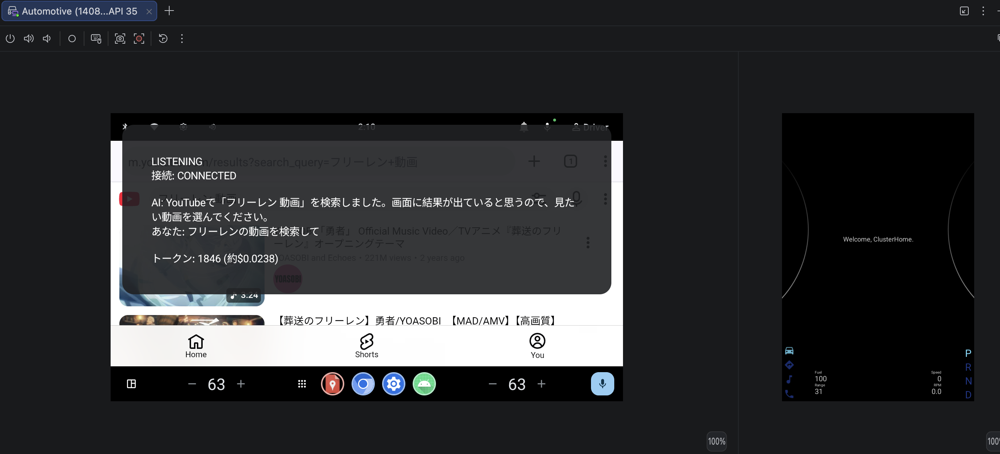
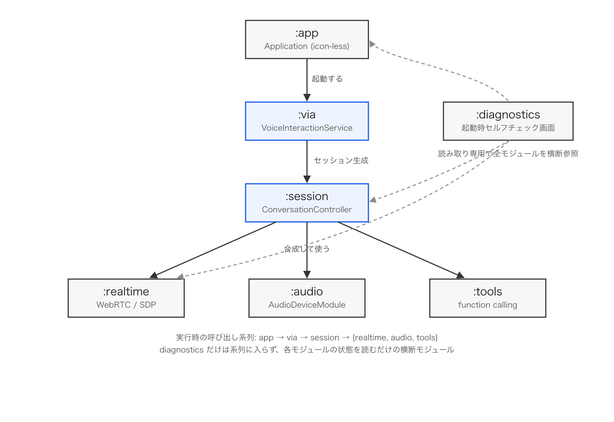

# VoiceInteractionAppSample

Android Automotive OS (AAOS) 向けの Voice Interaction App (VIA) サンプル。バックエンドに OpenAI Realtime API を WebRTC 経由で接続し、日本語で会話しながら車載アシスタントとして振る舞う。



## これは何か

AAOS には、Google Assistant の代わりに自作のアプリを既定の音声アシスタント（VIA）として登録できる仕組みがある。本サンプルはこの VIA の枠組みに OpenAI Realtime API（WebRTC）を接続し、以下を AAOS Emulator 上で動作確認したものである。

- PTT（画面上のマイクアイコン）から起動し、日本語で会話できる
- サーバー側 VAD による発話区間検出と、アシスタント発話中の割り込み（barge-in）
- function calling による YouTube 動画検索（`open_youtube_search`）— Chrome を明示起動して検索結果を開く
- セッション累計のトークン数・推定課金額(USD)をデバッグ表示
- アイドルタイムアウト・最大セッション時間による課金の歯止め
- 設定画面（Settings > Assistant & voice の歯車アイコン）から OpenAI Realtime ⇄ ローカル
  サーバー（`local_realtime_llm` 等）を再ビルド不要で切り替え可能（手順は
  [docs/how-to-run.md](docs/how-to-run.md) の「接続先サーバーを切り替える」を参照）
- **完全オンデバイスの Local Voice Agent モード**（サーバー・APIキー・ネットワーク不要）。
  SenseVoice STT + Gemma 4 E2B (LiteRT-LM) + supertonic-3-ja TTS + WebRTC APM(AEC3) を
  デバイス内で動かし、barge-in と YouTube 検索ツールコールまで同じ Voice Plate 上で動作する
  （セットアップは [docs/how-to-run.md](docs/how-to-run.md) の「Local Voice Agent」を参照）

## アーキテクチャ

`:via :realtime :audio :tools :session :localagent :diagnostics` の7モジュールに分かれている。会話バックエンドは `VoiceSessionController` インターフェースで差し替え可能で、OpenAI Realtime(WebRTC)の `ConversationController` とオンデバイスの `LocalAgentController` が並存する。呼び出しは `:app → :via → :session → {:realtime, :audio, :tools}` の一本道で、`:diagnostics` だけは実行系列に入らず全モジュールを横断参照する起動時セルフチェック画面になっている。



| モジュール | 役割 |
|---|---|
| `:via` | `VoiceInteractionService` / `VoiceInteractionSession` — VIA フレームワークとの接点 |
| `:session` | `ConversationController` — 会話の状態機械、接続ライフサイクル |
| `:realtime` | WebRTC の PeerConnection・SDP交換・DataChannel イベント |
| `:audio` | `JavaAudioDeviceModule` の生成、AEC/NS モード切替 |
| `:tools` | function calling のスキーマ登録・実行パイプライン |
| `:localagent` | 完全オンデバイスの Local Voice Agent（STT/LLM/TTS/AEC、`VoiceSessionController` の第 2 実装） |
| `:diagnostics` | 起動時セルフチェック画面 |

標準の OpenAI API キーは Android 端末に置かない。開発中はホスト PC 上で動く Session Broker のローカル代替（`backend/local_broker.py`）が保持し、Android 側は Broker が発行する短命な ephemeral credential だけを受け取る。その先の SDP 交換・ICE/DTLS 確立は OpenAI と直接行う（[docs/broker-contract.md](docs/broker-contract.md)）。

## 動かし方

Session Broker 本体はこのリポジトリのスコープ外。開発中は `backend/local_broker.py` をホスト PC 上で動かして代用する。

```bash
export OPENAI_API_KEY=sk-...
python3 backend/local_broker.py
```

```bash
./gradlew :app:installDebug
```

AAOS Emulator を既定の Voice Interaction App として登録し、マイクアイコンから会話を始める手順は [docs/how-to-run.md](docs/how-to-run.md) に手順化してある（マルチユーザーへの権限付与・既定アシスタント登録・Chrome インストールなど、AAOS 特有のはまりどころを含む）。

## 既知の制約

- PTT を押してから実際に会話できるまで、WebRTC 接続確立（credential取得・SDP交換・ICE/DTLS）に実測 2.4〜6.0 秒かかる。この待ち時間短縮は [Issue #41](https://github.com/aRaikoFunakami/VoiceInteractionAppSample/issues/41) で設計を検討中。
- Session Broker は認証方式が未確定（[docs/broker-contract.md](docs/broker-contract.md)）。実 Broker を実装する際はここから着手する必要がある。
- AEC の合否判定は未確定（[docs/aec-device-profiles.md](docs/aec-device-profiles.md)、実車評価待ち）。

## ドキュメント

- [docs/how-to-run.md](docs/how-to-run.md) — AAOS Emulator での動かし方
- [docs/dev-plan.md](docs/dev-plan.md) — 開発計画（Phase 0〜10、確定事項）
- [docs/broker-contract.md](docs/broker-contract.md) — Session Broker 連携契約
- [docs/aec-device-profiles.md](docs/aec-device-profiles.md) — AEC のデバイスプロファイル
- [docs/acceptance-checklist.md](docs/acceptance-checklist.md) — E2E 受け入れ条件チェックリスト
- [third_party/libwebrtc/README.md](third_party/libwebrtc/README.md) — 採用している WebRTC ライブラリの方針
- [docs/local-voice-agent-dev-plan.md](docs/local-voice-agent-dev-plan.md) — Local Voice Agent 対応の開発計画書（issue #46〜#51）
- [docs/third-party-licenses-local-agent.md](docs/third-party-licenses-local-agent.md) — Local Voice Agent のサードパーティライセンス
- [third_party/local_audio_engine/README.md](third_party/local_audio_engine/README.md) — オンデバイス音響エンジン（WebRTC APM）の方針
