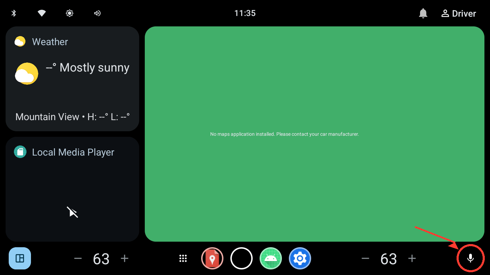
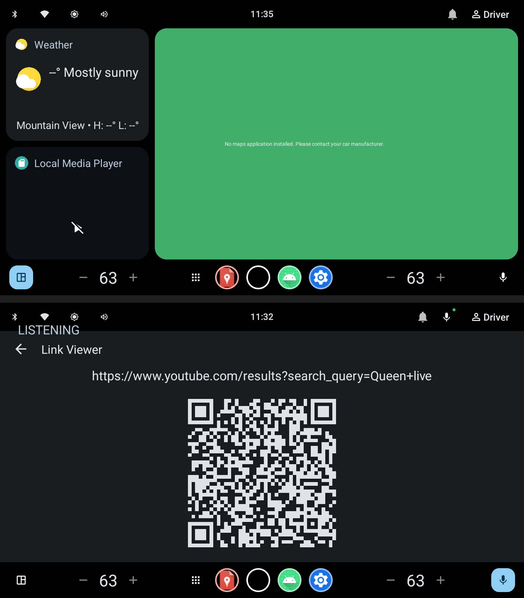
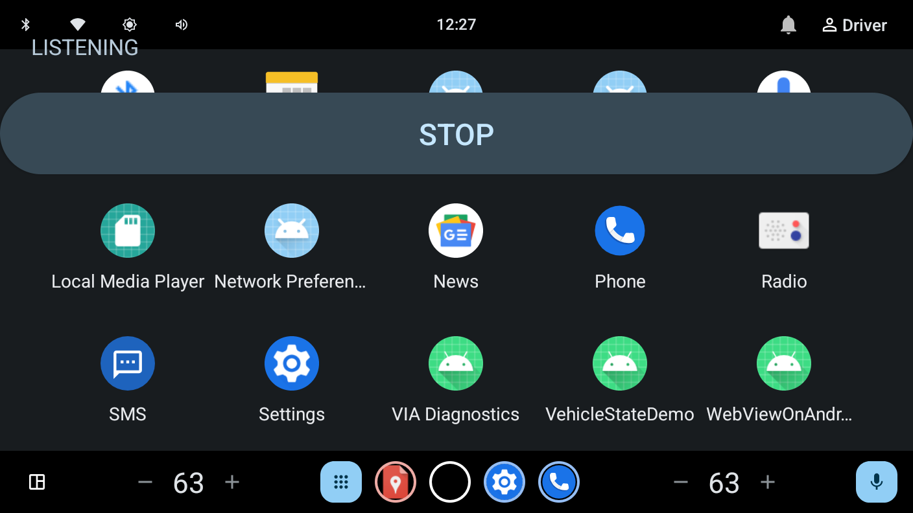

# 動かし方

このサンプルを実際にAAOS Emulator上で動かす手順。Session Brokerはスコープ外なので、
`backend/local_broker.py` をあなたのMac上で動かして代用する。

## 前提

- AAOS Automotive Emulator（`Automotive_1408p_landscape` 等）が起動していること
- エミュレータの Extended Controls > Microphone で **Enable Host Microphone Access** が ON
  になっていること（そうしないと実際にマイクの音が入らない — 詳細はこのセッションの
  会話ログ参照）
- `OPENAI_API_KEY` を環境変数として設定していること（**Androidアプリには一切渡らない** —
  ホスト側でBrokerだけが使う）

## 1. ローカルBrokerを起動する

```bash
export OPENAI_API_KEY=sk-...
python3 backend/local_broker.py
```

`local_broker listening on :8787` と出れば準備完了。**動かしている間はターミナルを開いたままにする。**

## 2. アプリをインストールする

```bash
./gradlew :app:installDebug
```

Android Studioの **Run** ボタンでも同じことができる。ただしRunは唯一のランチャー画面
（`DiagnosticsActivity`、診断画面）を自動起動するだけで、音声アシスタント本体は起動しない
——それは通常のActivityではなく `VoiceInteractionService` なので、Run/デバッグの対象には
ならない。起動方法はステップ5を参照。

## 3. マイク権限を付与する（AAOSは複数ユーザー — 全ユーザーに付与する）

```bash
adb shell pm list users
# 表示された全User IDに対して実行する（例: 0, 10）
adb shell pm grant --user 0  com.example.voiceinteractionappsample android.permission.RECORD_AUDIO
adb shell pm grant --user 10 com.example.voiceinteractionappsample android.permission.RECORD_AUDIO
adb shell am force-stop com.example.voiceinteractionappsample
```

（`am force-stop` が必要な理由: 既に起動済みのプロセスは権限を後から付与しても即座には
反映されないことがある — 実機検証で見つかった挙動。）

## 4. 既定のVoice Interaction Appとして登録する

**GUIから（実機検証済み・こちらでOK）**: Settings > Assistant & voice > 「Digital assistant
app」の**行のテキスト部分**をタップ（右端の歯車アイコンはGoogle Assistant自身の設定に
飛ぶだけで無関係・ハマりどころ）→ ピッカーで「VoiceInteractionAppSample」のラジオボタンを
タップ → **直後に出る確認ダイアログ（「The assistant will be able to read information
about apps...」）で必ずOKを押す**。ラジオボタンをタップしただけではまだ確定しない —
このダイアログでキャンセル/離脱すると選択前の状態に戻る。OKまで押せば
`voice_interaction_service`と`assistant`ロールの両方が正しく切り替わることを確認済み。

**⚠️ OKを押した後、画面を出入りすると「Digital assistant app: None」と表示されることが
ある** — これはCar Settings UI側の表示バグで、実体は壊れていない（実機検証済み:
`adb shell settings get secure voice_interaction_service` / `assistant` は両方とも正しく
このアプリを指したまま、`dumpsys voiceinteraction`のmComponent/mBoundも正常、実際に
`cmd voiceinteraction show`で起動もする）。サードパーティ製アシスタントアプリの名前を
このUIが解決できずNoneに落ちているだけと見られる。気にせず動作確認を続けてよい。

**adbから（同じ効果、`voice_interaction_service`のみ更新）**:

```bash
adb shell settings put secure voice_interaction_service \
  "com.example.voiceinteractionappsample/com.example.voiceinteractionappsample.via.VoiceInteractionServiceImpl"
```

**⚠️ エミュレータをコールドブートするとこの設定はGoogle Assistantに戻る**（アプリ自体や
RECORD_AUDIO権限は消えない — `voice_interaction_service`のsecure settingだけがリセット
される、実機検証で確認済み）。コールドブート後はGUIかadbのどちらかで選び直すこと。
Settings > Assistant & voice の「Voice input」行が消えていたらこれが原因。

## 5. 会話を始める

**Android Studio / エミュレータ画面から（推奨）**: エミュレータ画面右下、音量調整の右にある
**マイクアイコンをクリック**する。物理PTTボタンの代わりにこれがトリガーになっている
（実機検証済み）。マウス操作だけで完結し、adbコマンドは不要。



拡大するとこの位置（画面右下の角）:


クリック前（グレー・非アクティブ）とクリック後（青・アクティブ、Voice Plateが
"LISTENING"を表示）の比較:



コマンドラインから同じことをする場合:

```bash
adb shell cmd voiceinteraction show
```

Voice Plateが左上に表示され、状態（LISTENING/THINKING/SPEAKING/WORKING/ERROR）が
実際のOpenAI Realtime接続の進行に応じて切り替わる。ホストのマイクに向かって話すと、
アシスタントの音声が返ってくる（実際にMacのスピーカーから聞こえる）。

「Queenのライブ動画を見たい」のようにお願いすると、`open_youtube_search` toolが呼ばれ、
AAOSの標準機能である Link Viewer（QRコード表示、運転中にブラウザを直接開かせない仕組み）
が開く。

## 終了するには（重要）

Voice Plate上の **STOP** ボタンをタップする。これが最も確実。



同じマイクアイコンをもう一度クリックしても止まる。コマンドラインからは:

```bash
adb shell cmd voiceinteraction hide
```

**⚠️ エミュレータの画面をスリープさせても会話は止まらない。** 課金を心配してスリープ
させるのは効果が無い（実際に確認済み — スリープ中もマイクは録音を続け、WebRTC接続も
生きたままだった）。必ず上記のいずれかの方法で明示的に終了させること。

## 6. 診断画面（任意）

```bash
adb shell am start -n com.example.voiceinteractionappsample/com.example.voiceinteractionappsample.diagnostics.DiagnosticsActivity
```

build fingerprint、登録中のVoiceInteractionService、AEC対応状況、libwebrtcバージョン、
バックエンド到達性などが一覧で見える。

## 既知の制約

- `backend/local_broker.py` は認証なしのループバック専用デモ。実運用のSession Brokerを
  作る場合は `docs/broker-contract.md` の認証方式決定が先。
- `onHide()` を会話の完全終了として扱う簡略実装（`CarVoiceInteractionSession` のkdoc参照）。
- AECの合否判定自体は未確定（`docs/aec-device-profiles.md` 参照、実車評価待ち）。
